## Data Analysis and Visualisation to predict Purchased or not (Use of Logistic Regression)

In this project I'm trying to analyze and visualize the Output variable i.e Purchased. There are 3 input variable i.e Gender, Age and Estimated Salary depending on these input variable we can predict whether a specific user purchased or not Purchased from a shop 

## Data Description

    Gender - male or female
    
    Age - Age of User visiting shop.
    
    Estimated Salary - Salary of a user visiting shop.
    
    Purchased - 0=User does not purchased 1=User did purchased
    
## Process

    1)Read the data set
    
    2) EDA
    
    3)check multicollinearity between input feature
    
    4)check relation between continous input feature and categorical output feature (Using Anova Test)
    
    5)check relation bewteen categorical input feature and categorical output feature (Using Chi-square Test)
    
    6)Build the Model
    
    7)Test the Model
    
    8)Evaluate the model
    
## Softwares and Libraries Used:

       - Anaconda Distribution
	- Jupyter Notebook
	
	- Numpy
	- Pandas
	- Matplotlib
	- Seaborn
    - sklearn 
    - statsmodels
    - warnings

## Importing the Modules:

    import pandas as pd
    import os as os
    import numpy as np

    #Visuals
    import matplotlib.pyplot as plt
    import seaborn as sns

    #To split data
    from sklearn.model_selection import train_test_split

    # Models
    import statsmodels.api as sm
    from sklearn.linear_model import LinearRegression
    
    # Evalution 
    from sklearn.metrics import mean_squared_error, r2_score
    from scipy.stats import zscore
    
    import warnings
    warnings.filterwarnings("ignore")
    
## Analysis:

1)Univariant Analysis

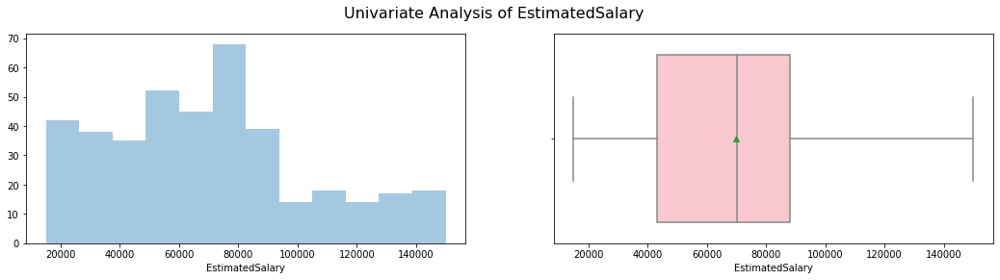

2)Bivariant Analysis

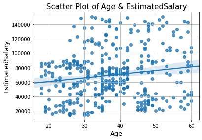

3)Correlation Using HeatMap

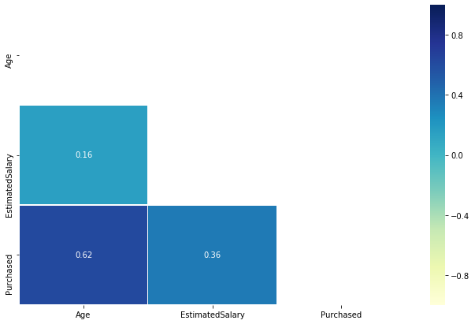

5)Anova Test

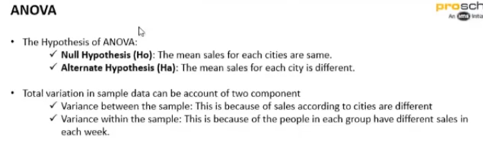

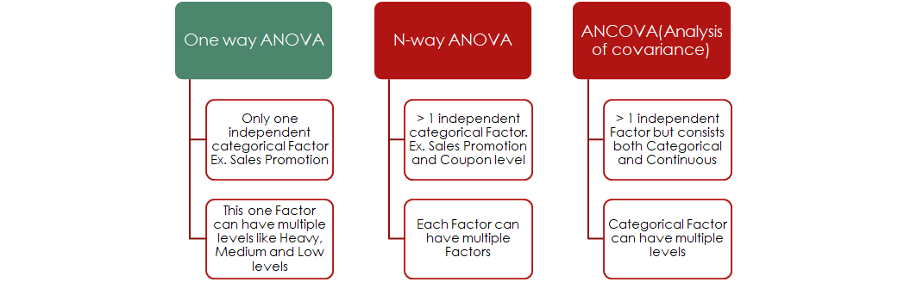

  We will use One Way Anova to check asscocaition between Age and Purchased, Then between Estimated Salary and Purchased.

6)Box Plot

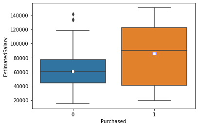

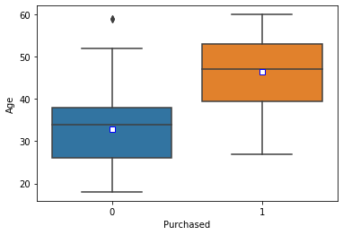

  Thus both box plot also shows tha mean is different for both age and estimated salary thus both feature are important and should be consider while model building
  
7)Chi-Sqaure Test : 
  To check Relation between two categorical feature
  
8)Scateerplot with approx boundry line:  

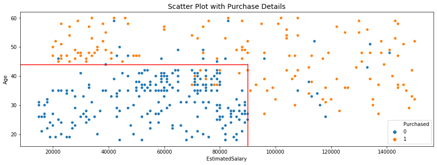

9)Model 1: Logistic Regression using Age

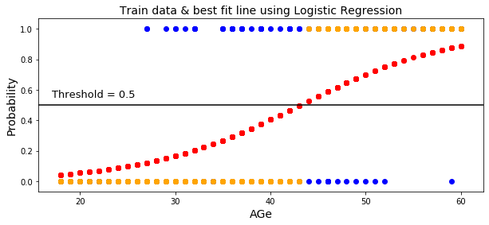

10)Confusion Matrix For Evaluation

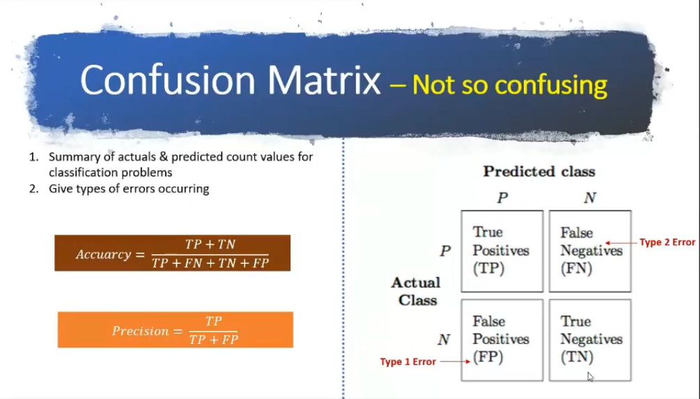

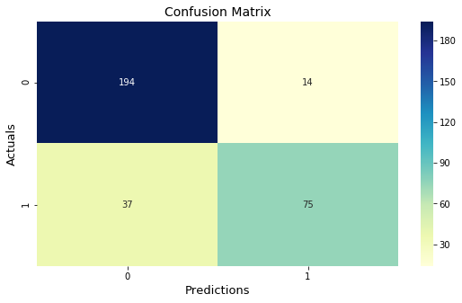

11)Standardization

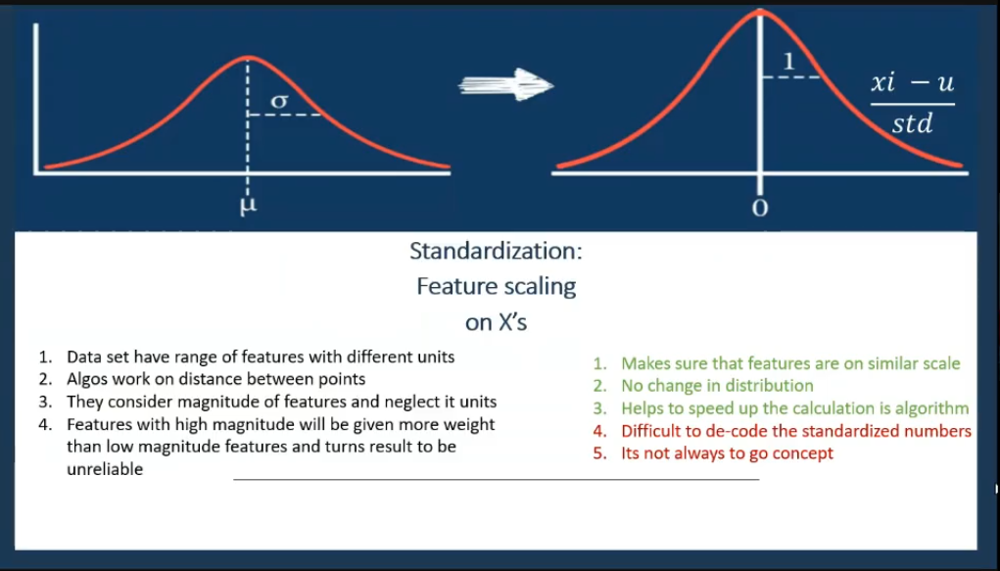

12)final scatter plot with actual boundry

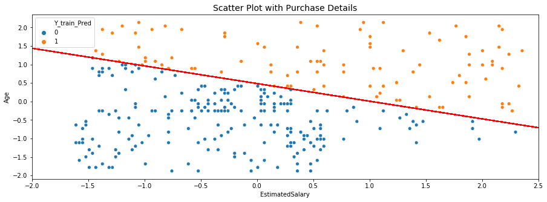

13) Consider Both Age and Estimated Salary standardized and final scatter plot

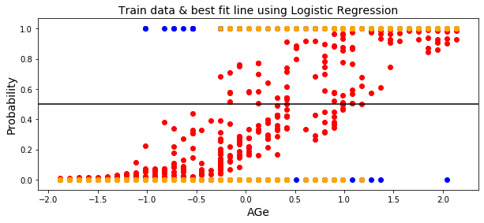

## Concluding statement 
    
   We can conclude that Age and Estimated Salary after standardizing gives an accuracy of 85% for train and 82% for test

## Note

  You can also view the code in HTML format

